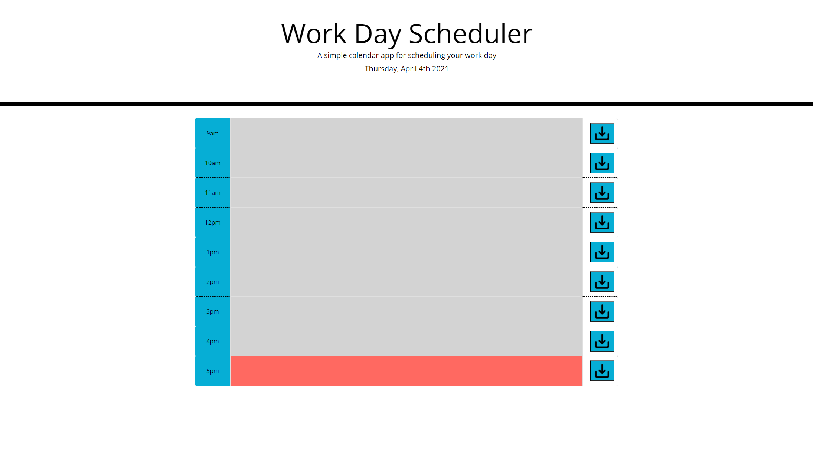

# Homework_5
Day planner made to help learn bootstrap. Made in conjunction Matt Reisdorf and Zach Duty.

Since this is an odd week, we had our starter html and css already written. We used bootstrap to import some list elements to create a table with an editable input message field and an operational save button, which works to store whatever is in the input field to local storage.

For first time use, the current day is stored to local storage.
For subsequent use, the currentDay variable in local storage is cross referenced to the actual current day, if they don't match, the local storage is wiped.
If LS isn't wiped, the input fields are auto populated to associated data stored in local storage.

There is a series of IF statements in the JS to check current 24 hour time to an associated block, and change the color of the block based on if its time is upcoming, present or past.

Bootstrap certainly made this project must easier.

## Live Deploy

# ReadmeGenerator

# Contact
Vygoth
JeremyJoanet@Protonmail.com

## Description
This Application allows users to create README files on the fly!

## Table of Contents
- [Usage](#Usage)
- [Installation](#Dependancies)
- [Testing](#Testing)
- [Credits](#Credits)
- [License](#License)
- [Contributing](#Contributing)
- [License Information](#LicenseInfo)
- [Screenshot](#Screenshot)

## Usage
To begin this application, please type node index.js with node installed.

## Dependancies
npm i

## Testing
N/A

## Credits
Zach Duty, Matt Reisdorf

## Contributing
N/A

## Screenshot

